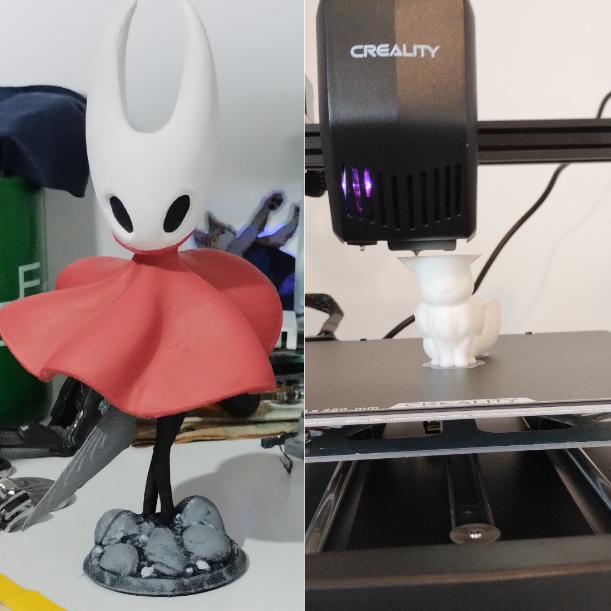
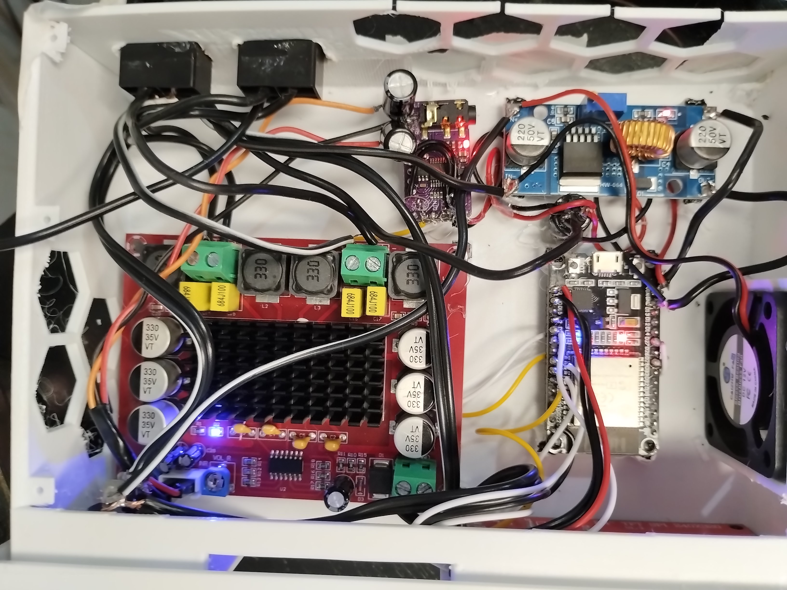
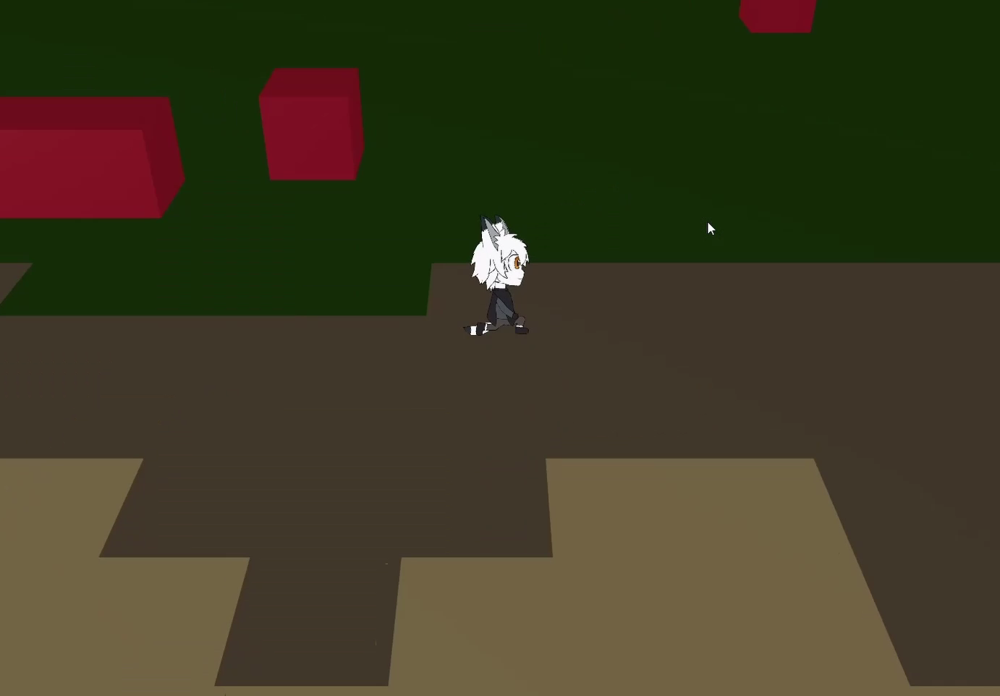
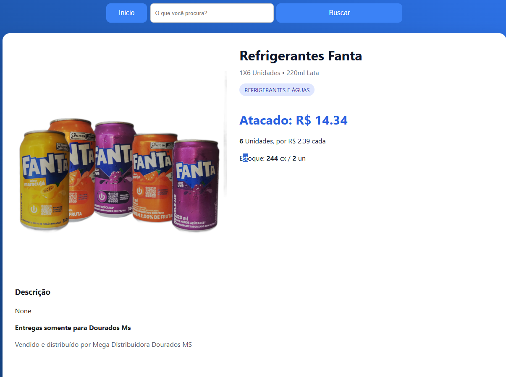

# Marcos Henrique Almeida Lima

  

Graduando na Universidade Federal da Grande Dourados (UFGD). Desenvolvedor Web, entusiasta de robótica e tecnologia, foco em baixo nível de programação, Modelador 3D, Game Developer e desenvolvedor de tecnologia.
 

Todos os projetos apresentados são de minha autoria e estou apto a detalhar tecnicamente cada um deles.

---

## 🛠️ Habilidades Técnicas

* **Linguagens & Frameworks:** C/C++, Python, Django, Flask, HTML, JSON.
* **Eletrônica & Robótica:** Microcontroladores (Arduino Nano, ESP32), integração de sensores e motores, prototipagem de circuitos.
* **Sistemas & Infraestrutura:** Configuração de servidores físicos (Jellyfin/CasaOS/EvolutionApi), ambiente WSL2.
* **Softwares & Bibliotecas:** Raylib, VS Code, Blender, Gimp, Creality print.

---

## 🚀 Principais Projetos e Evidências

### ⚙️ Impressão 3D e Modelagem
* **Descrição:** Desenvolvimento de projetos de modelagem 3D utilizando Blender, com foco em peças, caixas de circuitos e figures para impressão 3D.
* **Tecnologias:** Blender, Creality print, Gimp.

  
  

  <em>Impressão 3D e pintura de peças</em>

### 🤖 Automação e Microcontroladores (Arduino/ESP32)

* **Descrição:** Desenvolvimento de circuitos e programação de microcontroladores utilizando placas como Arduino Nano e ESP32, incluindo a integração e configuração de diversos sensores para coleta de dados, como sensores de temperatura, sensores infravermelhos.,.
* **Tecnologias:** C/C++, Eletrônica, IDE Arduino.
* **Link do repositório:** [[esp_audio](https://github.com/Glitcht0/esp_audio)]

  

  <em>Som automotivo feito por mim. Impressão em 3D</em>

 

### 👾 Desenvolvimento de Motor de Jogo (C++ e Raylib)

* **Descrição:** Desenvolvimento de engine própria em C++ utilizando Raylib, com foco em performance e geração procedural de mundo.
* **Tecnologias:** C++, Raylib, Lógica de Programação.

  

  <em>Jogo 3D com aspecto 2D de mundo procedural, engine própria</em>

 

### 💻 Sistema de Venda online no Atacado

* **Descrição:** Desenvolvimento de sistema de vendas online em Django para gestão comercial, incluindo controle de pedidos e interface Web.
* **Tecnologias:** Python, Django, HTML.

  

  <em>Sistema de vendas online desenvolvido por mim.</em>

